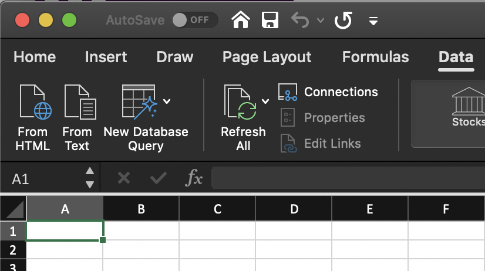
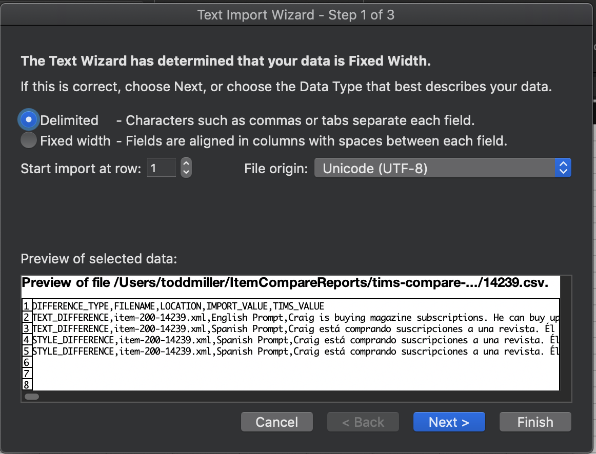
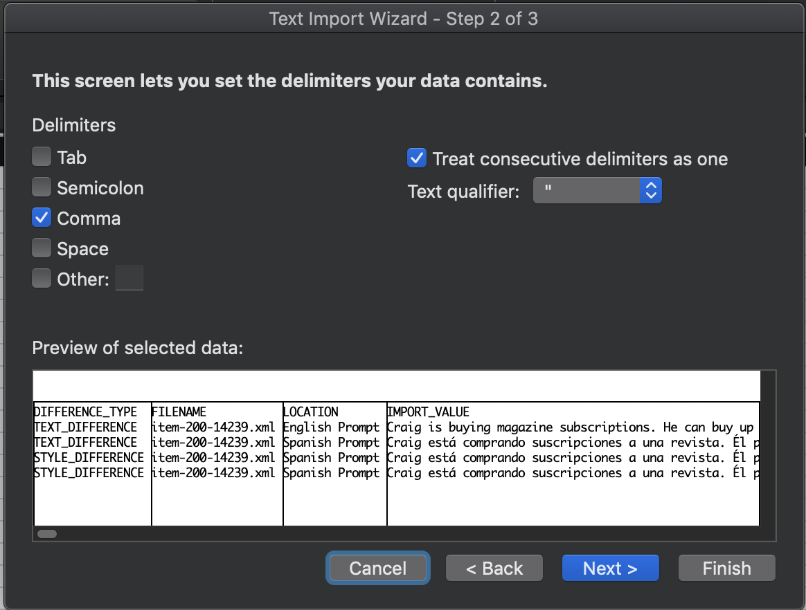

# Viewing reports in Excel.

Excel doesn't handle UTF-8 characters properly when opening CSV's.   There is an option to import the CSV text correctly into Excel but it requires extra steps.  This page provides screenshots to go along with the steps outlined [here](https://www.itg.ias.edu/content/how-import-csv-file-uses-utf-8-character-encoding-0).

# Steps to import UTF8 text
This requires an open Excel file present to import the CSV text.  UTF-8 characters will only be present in individual item reports since those characters are present in the item content HTML.

On an open Excel sheet go to the Data tab and click "Import Text"

Once the CSV file is selected a dialog should display allowing you to configure the text import.  You'll want to select UTF-8.

Make sure to set the separator to comma and select to treat double `""` characters as a single bloc.

Once all those are complete import the data.  This will handle the UTF-8 characters like accent.